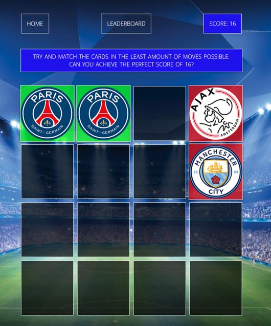
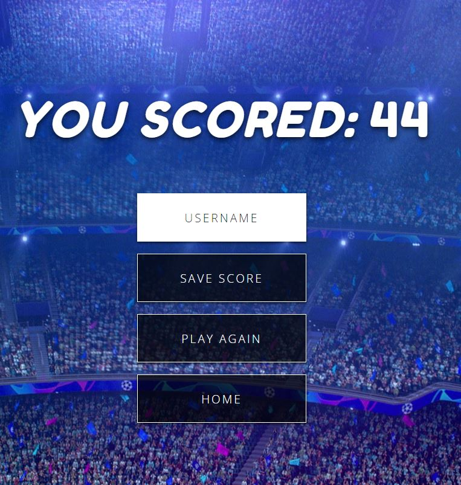
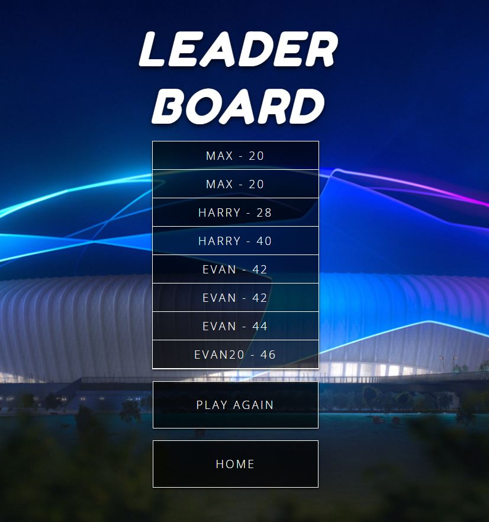

# Football Match

Football Match is a football/Champions League themed memory matching game which demonstrates the use of JavaScript to give the user a interactive frontend experience. This website is targeted towards adults and children interested in puzzle/memory games and football fans. 

Football Match is a fully responsive site which will give users the chance to compete against eachother to improve their scores and hopefully be added to the game's leaderboard. 

## Existing Features 
- __The Football Match Home Page__
  
  - This is the first page the user will be greeted with upon entry to the site. The background image is of the fictional Champions League Stadium which fits the overall team of the page. The Image is a outside view of the stadium giving the message to the user that they are not yet entered the game as they are still outside of the stadium. 
  - The user has the option to select PLAY which will direct the client into the game page of the website. 
  - The user also has the option to proceed to the leaderboard of the website to view the existing high scores before playing. 
  

- __The Game Area__

  - Upon entry to the game area the user is greeted by a 4x4 grid of blocks. The instruction is given above the grid on the goal of the game, to match as many blocks in the least amount of moves possible. Every block selection is counted and added to the users game score. The perfect game score is 16, given there is 16 blocks and a minimum of 16 clicks is required to complete the game. Each click by the user will reveal a football team logo, the goal is for the user to select the same logo one after another in order to get a match. 
  - The game background is of inside the Champions League Stadium giving the user the feeling that the game is about to start, similar to if the user was attending a football game in person. 
  - The user is also given the option to proceed to the leaderboard or return to the home page. 
  - If the client selects 2 blocks that do not match, the logos will be revealed for seconds, flash red and then return to hidden. The goal is for the user to learn from their mistakes and remember which logo is behind each block. 
  - Upon a correct guess the image will stay revealed and the block will turn green. 
  

- __The Score Area__

  - Once the user completes the game revealing all 16 team logos they will be redirected to the score page after a 2 second delay. 
  - The users score from there game will be displayed as the page heading. The user will have the option to save this score if they wish giving them the possibility of being added to the score leaderboard depending on their result. The user is required to enter a username before saving. 
  - If the user wishes to better there score they have the option to play again or return to the home screen. 
  

- __Score Leaderboard__

  - Provided the client saves their score they will be re-directed to the Score leaderboard and final page of the game. If the score was low enough it will be recorded on the leaderboard list otherwise they will be giving the option to play again or return home. 
  - The background image of the final page is a outside view of the Champions League Stadium giving the user the feeling that they have now left the stadium, left the game. 
  

## Validator Testing
- __HTML__
  - No errors were returned when passing through the official W3C validator.
- __CSS__
  - No errors were found when passing through the official (Jigsaw) validator.
- __JavaScript__
  - No errors were found when passing through the official Jshint Validator. 
     - The following metrics were returned from 3 seperate JS iles:
     - File game.js:
       - There are 5 functions in this file.
       - Function with the largest signature take 1 arguments, while the    median is 0.
       - Largest function has 23 statements in it, while the median is 3.
       - The most complex function has a cyclomatic complexity value of 5 while the median is 1.
     - File scores.js:
       - There are 4 functions in this file.
       - Function with the largest signature take 2 arguments, while the median is 0.5.
       - Largest function has 6 statements in it, while the median is 1.
       - The most complex function has a cyclomatic complexity value of 1 while the median is 1.
    - 

